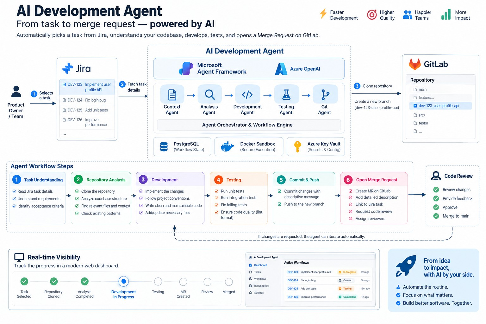
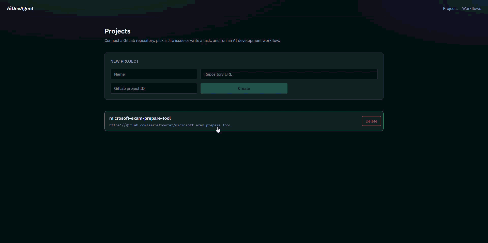
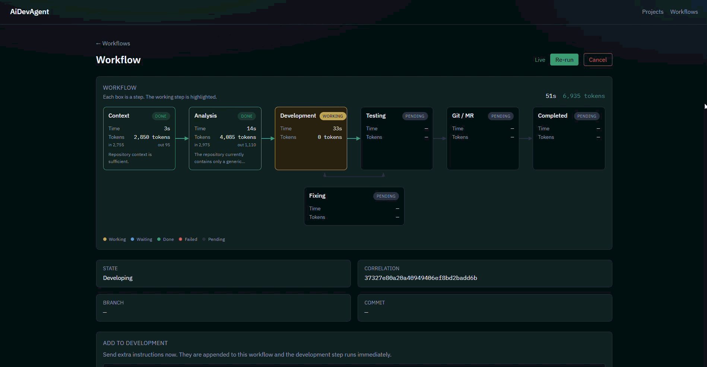

<p align="center">
  <a href="#ai-development-agent">English</a> · <a href="#ai-development-agent-türkçe">Türkçe</a>
</p>

# AI Development Agent

**From task to merge request — powered by AI.**

AI Development Agent is a software development **execution** platform. You pick a Jira issue (or write a task yourself), point it at a GitLab repository, and the platform runs a controlled workflow: understand the work, analyze the codebase, implement the change, build and test in an isolated Docker sandbox, then open a merge request.

The LLM provides reasoning. The platform stays in control.

<p align="center">
  
</p>

## What it does

Most AI coding tools are chat windows. This one is a workflow engine with a dashboard.

1. Select a task from Jira — or describe it yourself
2. Clone the GitLab repository and create a feature branch
3. Specialized agents analyze the code, implement the change, and run tests
4. Builds and tests run in an isolated Docker sandbox
5. The platform commits, pushes, and opens a GitLab Merge Request
6. You watch every step live, then review the MR like any other change

If reviewers request changes, the agent can iterate on the same branch.

<p align="center">
  
</p>

## Start a workflow

Open a project, then either pick an issue from the Jira board or backlog, or write a task name and description. The platform loads the Jira summary, description, and comments, then starts the workflow.

<p align="center">
  
</p>

## Watch it run

Five agents work in sequence:

| Agent | Role |
| --- | --- |
| **Context** | Checks that the task has enough information to begin |
| **Analysis** | Studies the repository and produces an implementation plan |
| **Development** | Changes source code through controlled tools |
| **Testing** | Builds and tests inside a Docker sandbox, then retries bounded fixes |
| **Git** | Creates a branch, commits, pushes, and opens a GitLab Merge Request |

The dashboard streams state, agent activity, and results as the workflow moves from *task selected* to *merge request created*.

<p align="center">
  
</p>

## Quick start

Prerequisites: .NET 10 SDK, Docker (PostgreSQL), Node 20+.

```bash
# API
dotnet run --project src/AiDevAgent.Api

# Web dashboard (proxies the API)
cd web && npm install && npm run dev
# → http://localhost:5173

# PostgreSQL (optional)
docker compose up -d postgres
```

Azure OpenAI and GitLab are optional. Without AI keys, agents fall back to offline heuristics so the dashboard still completes a stub workflow. Architecture docs live under [`docs/`](docs/) — start at [`docs/index.md`](docs/index.md).

```bash
pip install -r requirements-docs.txt
python -m mkdocs serve
```

---

# AI Development Agent (Türkçe)

**Görevden merge request’e — yapay zeka ile.**

AI Development Agent, bir yazılım geliştirme **yürütme** platformudur. Jira’dan bir iş seçersiniz (veya görevi kendiniz yazarsınız), bir GitLab deposuna bağlarsınız; platform kontrollü bir iş akışı çalıştırır: işi anlar, kod tabanını inceler, değişikliği uygular, izole bir Docker sandbox’ta derleyip test eder ve merge request açar.

Muhakemeyi LLM yapar. Kontrol platformda kalır.

<p align="center">
  
</p>

## Ne işe yarar?

Çoğu yapay zeka kodlama aracı bir sohbet penceresidir. Bu ürün ise panosu olan bir iş akışı motorudur.

1. Jira’dan bir görev seçin — veya kendiniz tarif edin
2. GitLab deposunu klonlayın ve bir özellik dalı oluşturun
3. Uzman ajanlar kodu analiz eder, değişikliği uygular ve testleri çalıştırır
4. Derleme ve testler izole bir Docker sandbox’ta koşar
5. Platform commit atar, push eder ve GitLab Merge Request açar
6. Her adımı canlı izlersiniz; ardından MR’ı her zamanki gibi incelersiniz

İnceleyenler değişiklik isterse ajan aynı dal üzerinde tekrar çalışabilir.

<p align="center">
  
</p>

## İş akışını başlatın

Bir projeyi açın; ardından Jira panosundan veya backlog’tan bir issue seçin, ya da görev adı ve açıklamasını yazın. Platform Jira özetini, açıklamasını ve yorumlarını yükler ve iş akışını başlatır.

<p align="center">
  
</p>

## Çalışırken izleyin

Beş ajan sırayla çalışır:

| Ajan | Rolü |
| --- | --- |
| **Context** | Görevin başlamaya yetecek kadar bilgi içerip içermediğini kontrol eder |
| **Analysis** | Depoyu inceler ve bir uygulama planı çıkarır |
| **Development** | Kaynak kodu kontrollü araçlarla değiştirir |
| **Testing** | Docker sandbox içinde derler ve test eder; sınırlı sayıda onarım dener |
| **Git** | Dal oluşturur, commit atar, push eder ve GitLab Merge Request açar |

Pano, iş akışı *görev seçildi* durumundan *merge request oluşturuldu* durumuna ilerlerken durumu, ajan aktivitelerini ve sonuçları canlı yayınlar.

<p align="center">
  
</p>

## Hızlı başlangıç

Gereksinimler: .NET 10 SDK, Docker (PostgreSQL), Node 20+.

```bash
# API
dotnet run --project src/AiDevAgent.Api

# Web panosu (API’ye vekillik eder)
cd web && npm install && npm run dev
# → http://localhost:5173

# PostgreSQL (isteğe bağlı)
docker compose up -d postgres
```

Azure OpenAI ve GitLab isteğe bağlıdır. AI anahtarları olmadan ajanlar çevrimdışı sezgisellere düşer; pano yine de iskelet bir iş akışını tamamlar. Mimari dokümanlar [`docs/`](docs/) altındadır — [`docs/index.md`](docs/index.md) ile başlayın.

```bash
pip install -r requirements-docs.txt
python -m mkdocs serve
```
