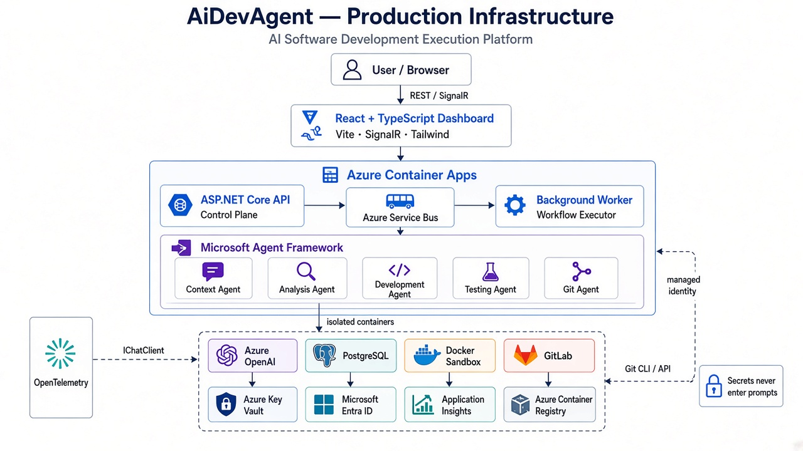
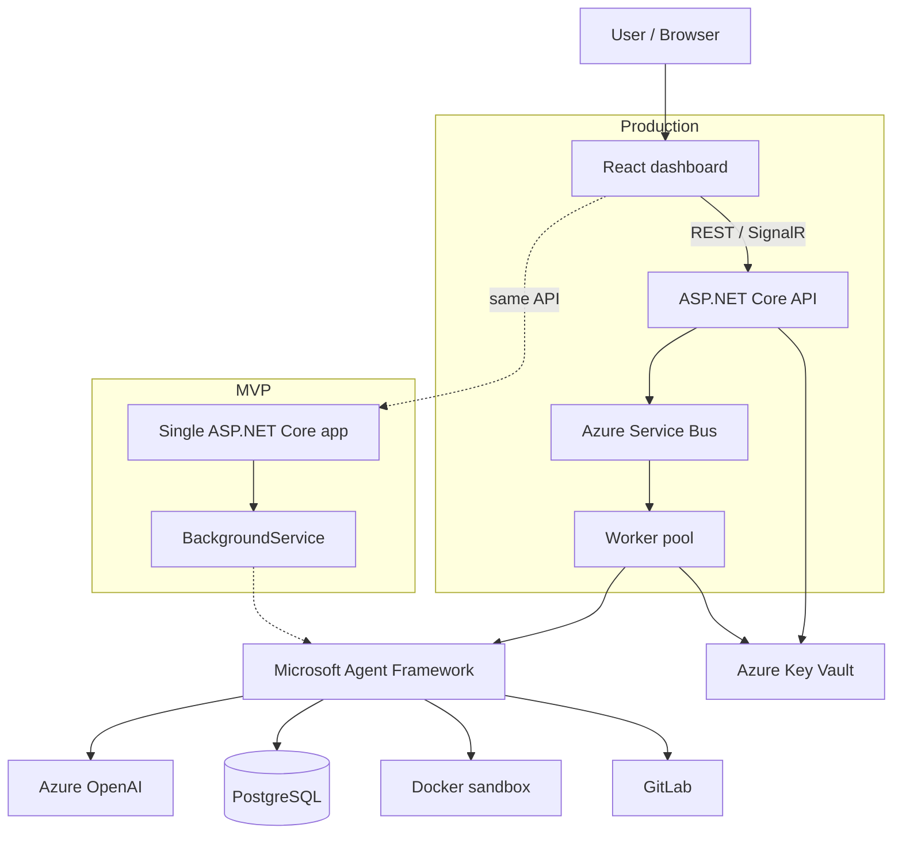

# Infrastructure

Production hosting for AiDevAgent is **Azure Container Apps**, with PostgreSQL as the workflow system of record, a Docker sandbox for untrusted build/test, and Azure OpenAI behind an `IChatClient` abstraction.



The labeled reference diagram:


## Layers

| Layer | What runs | Notes |
|-------|-----------|--------|
| Client | React + TypeScript dashboard | REST + SignalR; no secrets in the browser |
| Control plane | ASP.NET Core API | Creates workflows and returns immediately |
| Queue | Azure Service Bus (production) | MVP uses an in-process `BackgroundService` channel |
| Execution | Background worker | Must not run inside HTTP request lifetimes |
| Agents | Microsoft Agent Framework | Context, Analysis, Development, Testing, Git |
| Model | Azure OpenAI | Replaceable via `IChatClient` |
| State | PostgreSQL | Authoritative; SignalR is live overlay only |
| SCM | GitLab API + Git CLI | Tokens never enter prompts |
| Compute isolation | Docker sandbox | Host never runs arbitrary repo commands |
| Secrets | Azure Key Vault + Entra ID | Managed identity in production; env/user-secrets locally |
| Observability | OpenTelemetry → Application Insights | Correlate workflow, agent, and tool IDs |
| Images | Azure Container Registry | API, worker, sandbox images |

## Production vs MVP



## Local development

`docker-compose.yml` currently starts **PostgreSQL 16**. Azure OpenAI stays external. Secrets come from environment variables or .NET user-secrets — never from committed files.

```text
Developer machine
  ├── dotnet run  →  API + BackgroundService + SignalR
  ├── docker compose up postgres
  └── optional later: sandbox container, worker split
```

## Dependency rules

- **Api → Application → Domain**
- **Infrastructure → Application / Domain**
- **Agents → Application / Domain**

Domain must not depend on Azure OpenAI, GitLab SDK, Docker, EF Core, or ASP.NET Core.

## Scaling path

1. **MVP** — one ASP.NET Core app, one worker loop, one Azure OpenAI deployment
2. **Production** — Service Bus, worker pool, distributed locks, Key Vault, richer telemetry
3. **Advanced** — split agent services only when scaling, security, or lifecycle requires it
